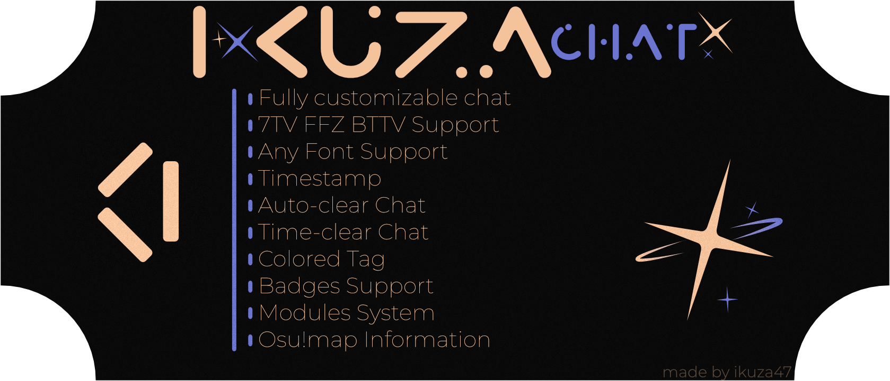

# IkuzaChat v2

<p align="center">
  
</p>

<p align="center">
  <a href="https://ikuzachat.ikuza.space/"></a>
  <a href="https://opensource.org/licenses/MIT"></a>
  <a href="https://github.com/ikuza47/ikuzachat"></a>
  <a href="https://twitch.tv/ikuza47"></a>
</p>

<p align="center">
  <b>Modern, highly customizable Twitch chat overlay for OBS Studio.</b><br>
  Built with vanilla web technologies — lightweight, fast, and feature-packed.
</p>


## What's New in v2?

- **Rebuilt Generator UI**: Instant tab navigation, and visual option selector cards with icons.
- **Interactive Live Preview**: Real-time responsive preview viewport and Light/Dark stream canvas switcher.
- **Multiple Chat Layouts**:
  - **Classic**: Clean, IRC-style Twitch stream chat.
  - **HellCakeFication**: Card-based modern layout with rich embeds, side panels, and customizable widths.
- **Full Emote & Badge Support**:
  - Twitch emotes, **7TV**, **BetterTTV (BTTV)**, and **FrankerFaceZ (FFZ)**.
  - Scalable broadcaster, moderator, VIP, and subscriber badges.
  - User avatars with selectable shapes and positions.
- **Smooth Animations**:
  - Configurable In and Out animations (**Fade**, **Slide**, **Pop**, or None) with customizable durations.
- **Smart Message Control**:
  - Auto-remove messages after a configurable timeout.
  - Native Twitch `/clear` command support.
  - `/me` action text formatting and local system/test messages.
- **Rich Modules**:
  - **osu! Module**: Rich beatmap embeds and user profile cards.
  - **Media Module**: Inline image and video previews from trusted users, moderators, and broadcaster.
  - **Bot Blocker**: Automatically hide some bots.

## Getting Started

### Using via the website

1. **Open [website]((https://ikuzachat.ikuza.space/))**

2. **Configure the overlay**
- Enter the name of your Twitch channel
- Configure the font and other settings
- Click "Copy link"

3. **Add Overlay in OBS**
- Add a new "Browser" source to OBS
- Paste the generated link into the URL field
- Set the appropriate dimensions
- Disable "Curse Capture" (optional)
---
### Installing on your PC (Recommended)

1. **Clone the repository**
```bash
git clone https://github.com/ikuza47/ikuzachat.git
cd ikuzachat
```

2. **Run index.html**

3. **Configure the overlay**
- Enter your Twitch channel name
- Adjust the font and other settings
- Click "Copy link"

4. **Add the overlay to OBS**
- Add a new "Browser" source to OBS
- Paste the generated link into the URL field
- Set the appropriate dimensions
- Disable "Curse Capture" (optional)

## Support

If you enjoy IkuzaChat and want to support its ongoing development:
- ⭐ Star this repository on GitHub!
- 💖 Support on [Boosty](https://boosty.to/ikuza47)
- 🟣 Follow on [Twitch](https://twitch.tv/ikuza47)

---

## License

Distributed under the **MIT License**. See [`LICENSE`](LICENSE) for more information.

<p align="center">
  <b>IkuzaChat v2</b> © 2026 • Developed with ❤️ by <a href="https://twitch.tv/ikuza47">ikuza47</a>
</p>
